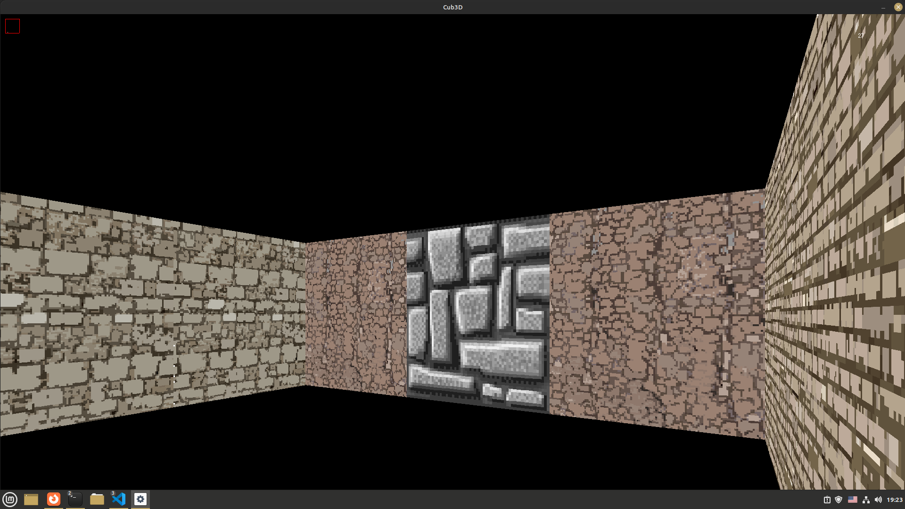

# CUB3D



School 21 C project aimed to learn the ray casting technology

## Description

Cub3D converts a map file to a 3d scene on the screen and allows to navigate through it. Window managment and event hooks are provided by minilibX library. MacOS version is provided by the school21, and linux version - by repository https://github.com/42Paris/minilibx-linux.git

## Installation

This project works only on Linux and MacOS.

Linux(Debian/Ubuntu) packages:
```bash
sudo apt-get install gcc make xorg libxext-dev libbsd-dev
```
MacOS packages:
```bash
sudo apt-get install gcc make # and probably some others, but Im not sure wich ones
```

After that run
```bash
make
```
and it should generate a binary file that you can use.

## Usage

Program recieves a map file of type .mcub as an argument. Sample map is stored at maps/map.mcub.

e.g.:
```bash
./cub3D maps/map.mcub
```

In the game you can use a mouse to rotate the camera, WASD to move on the scene.
Use Q key to let go the cursor.
Esc will exit the program.

## Known issues

- Currently segfaults if a player runs away from a screen.
- After a program finish KeyAutoRepeat option on Linux bugs out and requires a manual switch to turn it back on.
- Parser isn't tested well so it might behave unpredictably with incorrect maps.

## Notes

I created this version to implement my own graphics algorythms. The original project is stored on branch apple in this repo.
Because this project was built on top of another project some parts of its code are quite messy. I should probably clean it someday.